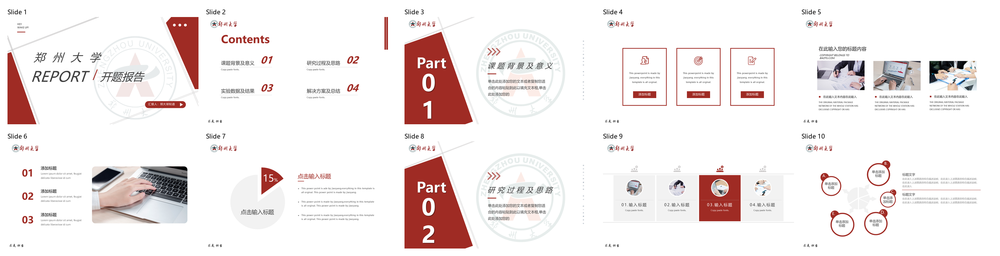
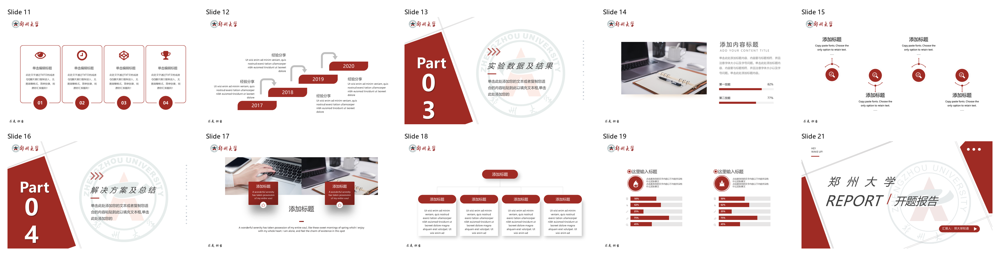
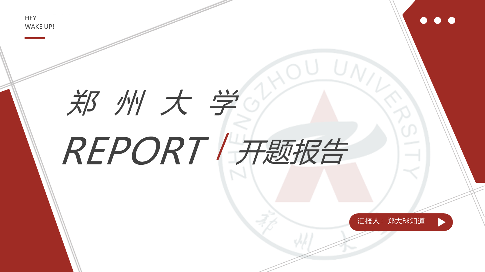
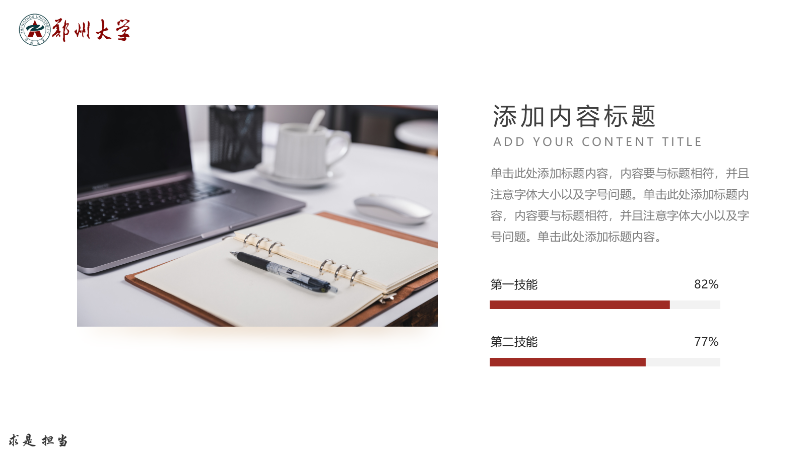

# Thesis Defense PPTX Skill

[中文说明](README.md)

## Quick Demo

A minimal end-to-end example lives at
[`examples/minimal_markdown/`](examples/minimal_markdown/). From the repo root:

```bash
python examples/minimal_markdown/run_example.py
```

It builds a tiny template, generates an editable defense deck, dumps the
deck's text/shape inventory, scans for stale template words, and writes a
contact sheet. The four committed reference images below come from a full run
against a **real Zhengzhou University defense/report PowerPoint template**:









> They were generated with:
>
> ```bash
> python examples/minimal_markdown/run_example.py \
>     --template <your-real-template.pptx> \
>     --full \
>     --expected-exclude-slides "20" \
>     --detail-slides "1,14"
> ```
>
> In `--template` mode the script **skips build_template / build_deck**
> because those only target the generated demo skeleton. Real template pages
> are kept natively and then passed through dump / scan / PowerPoint-COM PNG
> export / contact-sheet quality gates. Slide 20 is a QR-code promotional page
> from the shared template; it remains in `final.pptx` and the exported PNGs
> for full-deck checking, but is excluded from the public README contact sheets.

The example is intentionally cross-platform; real delivery still requires
Microsoft PowerPoint on Windows for COM-based export and overflow inspection.

A reusable Codex/Agent Skill for creating editable thesis defense PowerPoint decks from local thesis files and an existing `.pptx` visual template.

The workflow is designed for cases where template fidelity matters: university defense decks, lab report decks, branded academic presentations, and local private thesis projects.

## What It Does

- Reads thesis source material from a local PDF/LaTeX project.
- Preserves an existing PowerPoint template's cover, typography, colors, navigation, card style, and slide proportions.
- Builds editable `.pptx` decks instead of image-only slides.
- Exports slides to PNG for visual review.
- Generates a contact sheet for whole-deck inspection.
- Uses PowerPoint COM to detect risky text overflow based on real PowerPoint rendering.
- Scans for stale template text and placeholders before delivery.

## Why This Skill Exists

Many AI slide generators are good at creating a new deck style from a document. Thesis defense work often needs the opposite: keep an existing university or lab `.pptx` template almost unchanged, then replace the content with concise, defense-ready material.

This skill is optimized for that template-preservation workflow:

- It treats the user's supplied `.pptx` template as the visual source of truth.
- It copies native template slides first, then edits content in place.
- It keeps school colors, cover pages, navigation bars, card layouts, font sizes, and slide proportions aligned with the original deck.
- It favors conservative academic presentation wording over generic AI presentation copy.
- It validates the final deck with real PowerPoint rendering instead of only checking the file structure.

## Compared With `ppt-master`

[`ppt-master`](https://github.com/hugohe3/ppt-master) is an excellent open-source project for generating native, editable PowerPoint files from documents, Markdown, URLs, and other sources. It is especially strong when the goal is to create a new editable deck with AI-designed pages.

This skill has a narrower goal: thesis defense decks that must strictly follow an existing PowerPoint template.

| Dimension | `ppt-master` | `thesis-defense-pptx` |
|---|---|---|
| Primary goal | Generate native editable PPTX from source documents | Generate defense PPTX while preserving an existing template |
| Best fit | New AI-designed decks, document-to-PPT workflows, editable SVG/DrawingML pipelines | University defense decks, lab report decks, branded academic templates |
| Template handling | Can reference or create templates, but the workflow is design-generation oriented | Copies the user's original PPTX slides and edits them in place |
| Visual fidelity to an existing deck | Depends on template import and generated layout | Treated as the top priority |
| Output | Editable PPTX | Editable PPTX |
| Quality gate | SVG/project checks and export pipeline | PowerPoint PNG export, contact sheet review, overflow scan, stale text scan |

Use `ppt-master` when you want a powerful general-purpose AI PPT generation engine. Use this skill when your first requirement is: "do not redesign my school template; keep it looking like the original deck."

## How It Works

The skill follows a conservative local workflow:

1. Read the thesis PDF/LaTeX project and optional old defense deck.
2. Extract the research background, problem definition, method, experiments, figures, key results, and conclusion.
3. Inspect the supplied `.pptx` template for cover style, section pages, navigation labels, fonts, colors, cards, and spacing.
4. Clone or reuse native template slides with PowerPoint COM where available.
5. Replace text, images, tables, and charts using editable PowerPoint objects.
6. Export the generated deck to PNG and build a contact sheet.
7. Check text overflow, stale template words, missing figures, wrong navigation labels, and obvious visual issues.
8. Iterate until the deck is ready to review.

## Copyright And Relationship To `ppt-master`

This repository is not a fork of `ppt-master`, does not vendor `ppt-master`, and does not copy its source code. The current implementation uses its own small scripts around PowerPoint COM, `python-pptx`, Pillow, and PDF/text extraction utilities.

`ppt-master` is cited here as related work and as a useful comparison point. If future versions directly reuse code from `ppt-master`, the reused files and license notices should be included explicitly according to its MIT License.

Users are responsible for making sure they have the right to use their thesis text, figures, school templates, logos, and any third-party materials included in the generated deck.

## Community

[LINUX DO — 中文开发者社区](https://linux.do/)

This project recognizes and appreciates LINUX DO as a Chinese developer community for open-source sharing and technical discussion. This acknowledgement is not a claim of official endorsement unless separately stated by the community.

## Repository Layout

```text
skills/
└── thesis-defense-pptx/
    ├── SKILL.md
    ├── agents/
    │   └── openai.yaml
    ├── references/
    │   └── pptx_quality_gate.md
    └── scripts/
        ├── clone_template_deck.ps1
        ├── dump_pptx_content.py
        ├── export_pptx_png.ps1
        ├── extract_thesis_context.py
        ├── inspect_pptx_overflow.ps1
        ├── make_contact_sheet.py
        ├── pptx_template_tools.py
        └── scan_pptx_text.py
```

## Requirements

- Windows is recommended for full quality checking.
- Microsoft PowerPoint is required for COM-based slide cloning, PNG export, and overflow inspection.
- Python 3.10+.
- Python packages:
  - `python-pptx`
  - `Pillow`
  - `PyMuPDF` or `pypdf` for PDF extraction

Install the Python dependencies:

```powershell
python -m pip install python-pptx Pillow PyMuPDF pypdf
```

## Current Input Support

The bundled extractor currently supports PDF text extraction, LaTeX `.tex` section extraction, and candidate figure discovery. Word `.docx` extraction is not implemented yet. Markdown and plain text files may be read manually by an agent when relevant, but `extract_thesis_context.py` does not yet parse them into structured thesis sections.

## Install Locally

Copy the skill folder into your Codex skills directory:

```powershell
Copy-Item -Recurse -Force `
  .\skills\thesis-defense-pptx `
  "$env:USERPROFILE\.codex\skills\thesis-defense-pptx"
```

Then start a new Codex session and ask for a thesis defense PPTX, or explicitly mention:

```text
Use the thesis-defense-pptx skill.
```

## Core Workflow

1. Extract thesis context from local source files.
2. Analyze the supplied PowerPoint template.
3. Clone native template slides with PowerPoint COM.
4. Fill concise defense content into editable PPTX shapes.
5. Export slides to PNG.
6. Create a contact sheet and inspect it.
7. Run text overflow and stale-template checks.
8. Iterate until the deck passes the quality gate.

## Example Commands

Extract thesis context:

```powershell
python .\skills\thesis-defense-pptx\scripts\extract_thesis_context.py `
  --input "D:\path\to\thesis-project" `
  --output "D:\path\to\thesis_context.md"
```

Dump every slide's shapes/text/tables/pictures (recommended before any content fill, so you can copy exact strings into your replacement dicts):

```powershell
python .\skills\thesis-defense-pptx\scripts\dump_pptx_content.py `
  --pptx "D:\path\to\skeleton.pptx" `
  --output "D:\path\to\dump.md"
```

Add `--slide 4,8,9` to dump only specific slides while iterating.

Export a deck to PNG:

```powershell
powershell -NoProfile -ExecutionPolicy Bypass `
  -File .\skills\thesis-defense-pptx\scripts\export_pptx_png.ps1 `
  -Pptx "D:\path\to\deck.pptx" `
  -OutDir "D:\path\to\visual_check" `
  -Width 1600 -Height 900
```

Inspect text overflow:

```powershell
powershell -NoProfile -ExecutionPolicy Bypass `
  -File .\skills\thesis-defense-pptx\scripts\inspect_pptx_overflow.ps1 `
  -Pptx "D:\path\to\deck.pptx" `
  -Tolerance 40
```

Create a contact sheet:

```powershell
python .\skills\thesis-defense-pptx\scripts\make_contact_sheet.py `
  --input "D:\path\to\visual_check" `
  --output "D:\path\to\contact_sheet.png"
```

## Notes

This skill intentionally does not ship a built-in slide template. It is meant to preserve the user's supplied template rather than impose a generic presentation style.

## License

This project is licensed under the [Apache License 2.0](LICENSE).

Apache-2.0 allows use, modification, distribution, private use, and commercial
use, subject to the license terms.

Commercial sustainability is intended to come from services, custom template
adaptation, hosted workflows, enterprise support, template packs, and voluntary
sponsorship rather than restricting use of the core skill. See
[COMMERCIAL.md](COMMERCIAL.md).
