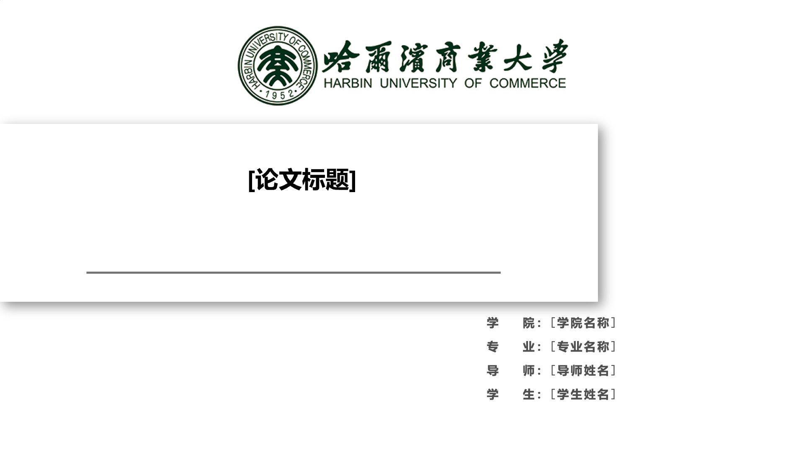
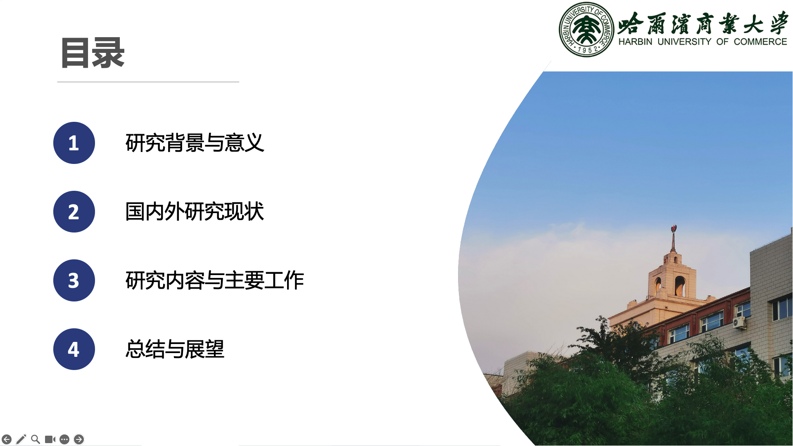
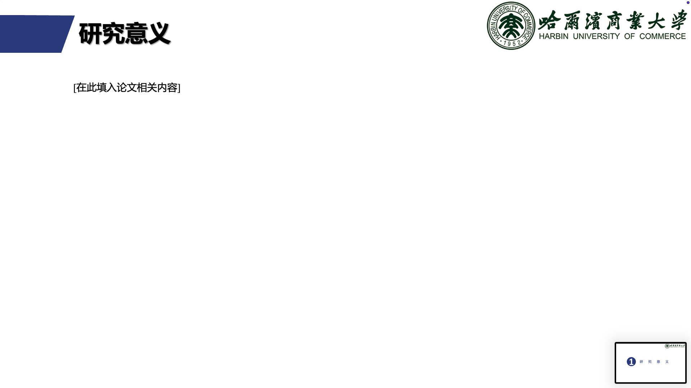
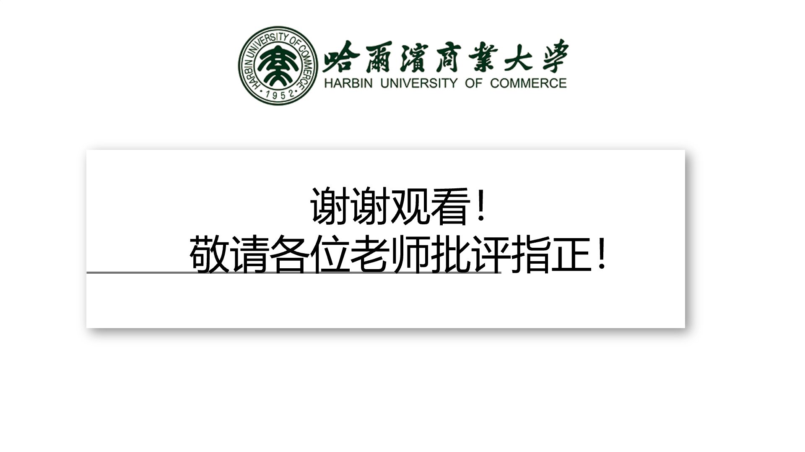

# Thesis Defense PPTX Skill

一个用于生成本科/研究生毕业论文答辩 PPT 的 Codex/Agent Skill。它面向需要严格复用本地 PowerPoint 模板的场景，能够从本地论文 PDF/LaTeX 项目和指定 `.pptx` 模板出发，生成可编辑的正式答辩 PPTX，并执行逐页导出、版式检查和文字溢出检查。

[English README](README.en.md)


---

## 一分钟看效果

仓库自带最小可跑示例 [`examples/minimal_markdown/`](examples/minimal_markdown/)，在仓库根目录跑：

```bash
python examples/minimal_markdown/run_example.py
```

下面预览图来自本 Skill 内置的**哈尔滨商业大学 (HRBCU) 通用答辩模板**
（`skills/thesis-defense-pptx/templates/HRBCU-defense-template.pptx`），
模板已清除个人内容，全部正文替换为中文占位符：










> 上图为经过去个人化处理的 HRBCU 模板原貌。HRBCU 同校/同导师同学可直接使用
> 内置模板；其他学校用户需提供自己的 `.pptx` 模板：
>
> ```bash
> python examples/minimal_markdown/run_example.py \
>     --template <你的本地模板.pptx>
> ```

> 该示例不依赖 Microsoft PowerPoint，因此 macOS / Linux / Windows 都能跑通。
> 真实交付仍建议在 Windows + PowerPoint 下走 COM 导出和文字溢出检查。

## 功能

- 从本地论文 PDF/LaTeX 项目中提取论文内容和候选图表。
- 尽量保留已有 PowerPoint 模板的封面、字体、字号、配色、导航、卡片样式和页面比例。
- 输出真实可编辑的 `.pptx` 文件，而不是图片型幻灯片。
- 内置哈尔滨商业大学通用答辩模板（`skills/thesis-defense-pptx/templates/HRBCU-defense-template.pptx`），该模板同学/同导师可直接使用。
- 使用 PowerPoint COM 导出逐页 PNG，便于视觉检查。
- 生成整套 PPT 的总览图，快速发现版式问题。
- 使用真实 PowerPoint 渲染结果检查文字框溢出风险。
- 检查旧模板文字、占位词、TODO 等残留内容。

## 为什么需要这个 Skill

很多 AI PPT 工具擅长从文档重新设计一套新风格 PPT。但毕业论文答辩经常有相反的需求：学校或学院已经给了 `.pptx` 模板，封面、校徽、配色、顶部导航、卡片式正文、字体大小都不希望被改掉，只需要把论文内容转成适合答辩展示的表达。

本 Skill 针对的正是这种“严格套用现成模板”的工作流：

- 把用户提供的 `.pptx` 模板作为视觉基准。
- 优先复制模板中的原生页面，再替换内容。
- 尽量保持封面、章节页、导航条、卡片样式、字体字号、颜色和页面比例。
- 将论文段落转写为正式、简洁、适合答辩讲述的页面内容。
- 使用真实 PowerPoint 导出结果做逐页检查，而不是只检查文件能否生成。

## 与 `ppt-master` 的对比

[`ppt-master`](https://github.com/hugohe3/ppt-master) 是一个优秀的开源项目，主打从 PDF、Word、Markdown、网页等资料生成原生可编辑 PPTX。它更适合从资料出发重新生成一套 AI 设计的可编辑 PPT。

本 Skill 的目标更窄：生成毕业论文答辩 PPT，并尽量严格沿用用户已有的 PowerPoint 模板。

| 维度 | `ppt-master` | `thesis-defense-pptx` |
|---|---|---|
| 核心目标 | 从资料生成原生可编辑 PPTX | 在保留现有模板的基础上生成答辩 PPTX |
| 适用场景 | 新建 AI 设计风格 PPT、文档转 PPT、可编辑 SVG/DrawingML 流程 | 本科/研究生答辩、学院模板、实验室模板、品牌学术汇报 |
| 模板处理 | 可以参考或创建模板，但整体偏生成式设计 | 直接复制用户原始 PPTX 模板页并在其上替换内容 |
| 对既有模板的还原度 | 取决于模板导入和生成效果 | 作为最高优先级处理 |
| 输出形态 | 可编辑 PPTX | 可编辑 PPTX |
| 质量检查 | SVG/project 检查和导出流程 | PowerPoint 导出 PNG、总览图检查、文字溢出检查、旧模板词扫描 |

如果你想从资料生成一套全新的可编辑 PPT，`ppt-master` 更合适；如果你已经有学校模板，并且要求“封面、配色、导航、卡片风格都别乱改”，本 Skill 更合适。

## 工作原理

本 Skill 采用保守的本地生成流程：

1. 读取论文 PDF、LaTeX 项目和可选旧版答辩 PPT。
2. 提取研究背景、问题定义、方法设计、实验设置、实验结果、结论和候选图表。
3. 分析用户提供的 `.pptx` 模板，包括封面、目录、章节页、导航、字体、字号、颜色、卡片和间距。
4. 在可用时使用 PowerPoint COM 复制模板原生页面，生成稳定的 PPT 骨架。
5. 用可编辑的 PowerPoint 文本框、图片、表格和图形替换内容。
6. 导出逐页 PNG，生成整套 PPT 的总览图。
7. 检查文字溢出、旧模板词残留、图片缺失、导航错误和明显视觉问题。
8. 根据检查结果继续修复，直到达到交付标准。

## 版权与 `ppt-master` 关系说明

本仓库不是 `ppt-master` 的 fork，不内置 `ppt-master`，也没有复制 `ppt-master` 的源代码。当前实现是围绕 PowerPoint COM、`python-pptx`、Pillow 和 PDF/文本提取工具编写的一组独立脚本。

README 中引用 `ppt-master` 是为了说明相关开源项目和适用场景差异。若未来版本直接复用 `ppt-master` 的代码，应按照其 MIT License 明确保留对应源码文件和版权/许可声明。

使用者需要自行确认其论文文本、实验图、校徽、字体和第三方素材具备合法使用权限。本 Skill 内置一份哈尔滨商业大学 (HRBCU) 通用答辩模板（已清除个人内容），其他学校用户需自备模板。

## 仓库结构

```text
skills/
└── thesis-defense-pptx/
    ├── SKILL.md
    ├── agents/
    │   └── openai.yaml
    ├── references/
    │   ├── hrbcu_template.md        # 哈商大模板逐页说明
    │   └── pptx_quality_gate.md
    ├── templates/
    │   └── HRBCU-defense-template.pptx  # 哈商大通用答辩模板（22页，已清除个人内容）
    └── scripts/
        ├── clone_template_deck.ps1
        ├── dump_pptx_content.py
        ├── export_pptx_png.ps1
        ├── extract_thesis_context.py
        ├── inspect_pptx_overflow.ps1
        ├── make_contact_sheet.py
        ├── pptx_template_tools.py
        └── scan_pptx_text.py
```

## 环境要求

- 推荐在 Windows 上使用。
- 如果需要完整质量检查，需要安装 Microsoft PowerPoint。
- Python 3.10 或更高版本。
- Python 依赖：
  - `python-pptx`
  - `Pillow`
  - `PyMuPDF` 或 `pypdf`

安装依赖：

```powershell
python -m pip install python-pptx Pillow PyMuPDF pypdf
```

## 当前输入支持范围

当前内置提取脚本主要支持 PDF 文本提取、LaTeX `.tex` 章节提取和候选图表扫描。Word `.docx` 提取尚未实现。Markdown 和纯文本文件可以由 Agent 在需要时手动读取参考，但 `extract_thesis_context.py` 目前还不会把它们解析成结构化论文上下文。

## 本地安装

将 Skill 复制到 Codex skills 目录：

```powershell
Copy-Item -Recurse -Force `
  .\skills\thesis-defense-pptx `
  "$env:USERPROFILE\.codex\skills\thesis-defense-pptx"
```

然后新开一个 Codex 会话，直接提出生成答辩 PPT 的需求，或明确说明：

```text
使用 thesis-defense-pptx skill。
```

## 推荐流程

1. 从论文 PDF/LaTeX 项目中提取研究背景、方法、实验和结论。
2. 分析用户提供的 PowerPoint 模板。
3. 使用 PowerPoint COM 复制模板原生页面，生成 PPT 骨架。
4. 将论文内容转写为答辩口径，填入可编辑文本框、表格和图表。
5. 导出每页 PNG。
6. 生成总览图并进行视觉检查。
7. 检查文字溢出和旧模板词残留。
8. 根据检查结果反复修复，直到通过质量门槛。

## 常用命令

提取论文上下文：

```powershell
python .\skills\thesis-defense-pptx\scripts\extract_thesis_context.py `
  --input "D:\path\to\thesis-project" `
  --output "D:\path\to\thesis_context.md"
```

导出整套 PPT 的形状/文本/表格/图片清单（推荐在做任何内容替换前先跑一次，把精确字符串复制到替换字典里）：

```powershell
python .\skills\thesis-defense-pptx\scripts\dump_pptx_content.py `
  --pptx "D:\path\to\skeleton.pptx" `
  --output "D:\path\to\dump.md"
```

可以加 `--slide 4,8,9` 只 dump 指定页，便于迭代调试。

导出 PPTX 为逐页 PNG：

```powershell
powershell -NoProfile -ExecutionPolicy Bypass `
  -File .\skills\thesis-defense-pptx\scripts\export_pptx_png.ps1 `
  -Pptx "D:\path\to\deck.pptx" `
  -OutDir "D:\path\to\visual_check" `
  -Width 1600 -Height 900
```

检查文字溢出：

```powershell
powershell -NoProfile -ExecutionPolicy Bypass `
  -File .\skills\thesis-defense-pptx\scripts\inspect_pptx_overflow.ps1 `
  -Pptx "D:\path\to\deck.pptx" `
  -Tolerance 40
```

生成总览图：

```powershell
python .\skills\thesis-defense-pptx\scripts\make_contact_sheet.py `
  --input "D:\path\to\visual_check" `
  --output "D:\path\to\contact_sheet.png"
```

## 说明

本 Skill 内置了一份哈尔滨商业大学（HRBCU）的通用答辩模板，来自真实答辩 PPTX 并经过去个人化处理，保留全部视觉结构（封面布局、章节分隔、导航元素、学校 logo），内容区域替换为占位符。同校/同导师的同学可以直接使用，无需再提供模板。其他学校的用户仍需提供自己的 `.pptx` 模板。

模板详情见 `skills/thesis-defense-pptx/references/hrbcu_template.md`。

## 许可证

本项目采用 [Apache License 2.0](LICENSE) 开源许可。

Apache-2.0 允许使用、修改、分发、私有使用和商业使用，但需要遵守许可证条款。

项目的商业化方向不是限制核心 skill 的使用，而是围绕服务、定制模板适配、托管流程、企业支持、模板包和自愿赞助来实现可持续发展。详见 [COMMERCIAL.md](COMMERCIAL.md)。

## 社区

[LINUX DO — 中文开发者社区](https://linux.do/)

本项目认可并感谢 LINUX DO 社区在中文开发者开源交流、项目分享和技术讨论中的价值。除非社区另有明确说明，此处仅为社区致谢和链接，不代表官方背书。
