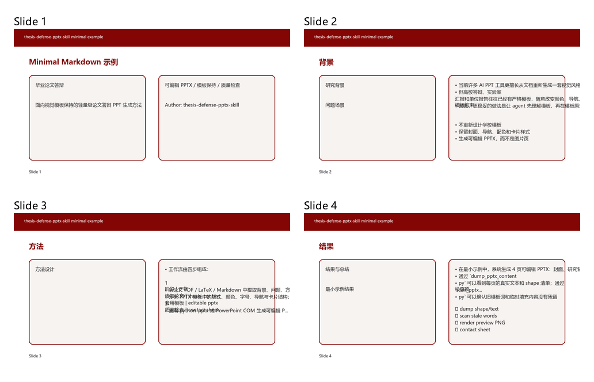

# Minimal Markdown 示例

这是一个**最小可跑**示例，用来展示 `thesis-defense-pptx` skill 的核心形态：

1. 从一份很小的 Markdown 论文摘要中抽取答辩内容；
2. 现场生成一个极简 `.pptx` 模板；
3. 在保留模板视觉风格的基础上生成可编辑 `final.pptx`；
4. 运行仓库自带的 `dump_pptx_content.py` 和 `scan_pptx_text.py`；
5. 用纯 Python 渲染一组示意 PNG，并调用 `make_contact_sheet.py` 生成总览图。

> 注意：这个示例故意不依赖 Microsoft PowerPoint，因此 macOS / Linux / Windows
> 都能跑通。真实交付时仍建议在 Windows + PowerPoint 下执行 COM 导出、文字溢出
> 检查和最终人工视觉检查。

## 文件清单

```text
examples/minimal_markdown/
├── README.md
├── thesis.md                 # 极简论文内容
├── build_template.py          # 生成 sample_template.pptx
├── build_deck.py              # 基于模板生成可编辑 final.pptx
├── render_preview.py          # 纯 Python 生成示意 slide PNG
├── run_example.py             # 一键跑完整示例
└── expected/
    ├── contact_sheet.png      # 参考总览图
    └── README.md
```

仓库不直接提交 `sample_template.pptx` / `final.pptx` 等中间产物，它们由脚本现场
生成，避免二进制文件干扰 review。

## 运行

在仓库根目录：

```bash
python examples/minimal_markdown/run_example.py
```

成功后会看到这些产物：

```text
examples/minimal_markdown/
├── sample_template.pptx
├── final.pptx
├── dump.md
├── scan.json
├── rendered_slides/
│   ├── slide_01.png
│   ├── slide_02.png
│   ├── slide_03.png
│   └── slide_04.png
└── contact_sheet.png
```

## 预览

下面是本示例生成的参考总览图：



## 示例覆盖了哪些能力

- `python-pptx` 生成可编辑 PPTX；
- 复制/延续模板配色、字体、顶部导航和卡片式正文布局；
- `pptx_template_tools.py` 的 `add_text` / `add_para` / `tag` / `rect` / `write_table`；
- `dump_pptx_content.py` 导出每页 shape/text/table 清单；
- `scan_pptx_text.py` 检查旧模板词 / 临时填充内容残留；
- `make_contact_sheet.py` 基于导出的 PNG 生成整套 PPT 总览图。

## 和真实工作流的差异

这个最小示例只为了让读者快速跑通仓库脚本。真实毕业论文答辩 PPT 还需要：

- 读取完整论文 PDF/LaTeX 和候选图表；
- 分析用户自己的 `.pptx` 模板；
- 在 Windows + PowerPoint 下导出真实幻灯片 PNG；
- 跑 COM 文字溢出检查；
- 人工检查封面、目录、导航、图表比例、文字密度和学校格式要求。
